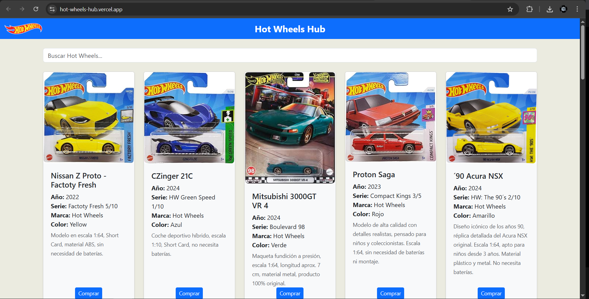
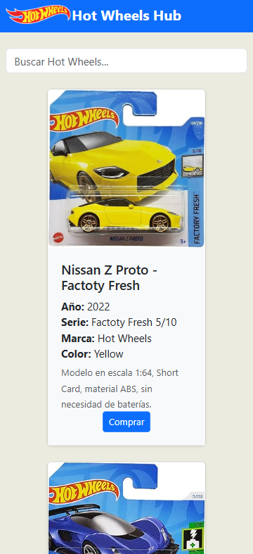

# 🚗 Hot Wheel Hub
**Aplicación web para coleccionistas** que funciona como una **Pokédex exclusiva para modelos de Hot Wheels**.  

Diseñada para centralizar información sobre modelos, disponibilidad y precios, facilitando la búsqueda y comparación para aficionados y coleccionistas.

  

🌐 **Demo pública:**  
👉 [hot-wheels-hub.vercel.app](https://hot-wheels-hub.vercel.app)

---

## 🎯 Objetivo

Hot Wheel Hub permite explorar y buscar modelos de Hot Wheels de manera eficiente, integrando enlaces de afiliados para compras en línea y generando oportunidades de monetización.  
Ideal para coleccionistas que buscan una plataforma unificada en lugar de múltiples sitios web, foros y tiendas dispersas.

---

## ⚙️ Tecnologías utilizadas

- **React** – Biblioteca de JavaScript para el desarrollo del frontend con componentes reutilizables.
- **Bootstrap** – Framework de CSS y JavaScript para interfaces responsivas.
- **Firebase** – Plataforma Backend-as-a-Service para base de datos, autenticación y almacenamiento.
- **Vercel** – Hosting y despliegue para la aplicación web.
- **Amazon Afiliados y eBay Partners** – Para monetización mediante enlaces de compra.

---

## 📦 Futuras actualizaciones

- 📦 Ampliación del catálogo con más detalles como año de lanzamiento, ediciones especiales y rareza  
- 👤 Sistema de usuarios con perfiles, listas de favoritos y colecciones personalizadas  
- ⭐ Sistema de valoración y comentarios para reseñas de modelos  
- 🛒 Integración con más plataformas de afiliados para opciones de compra e intercambio  
- 📱 Versión móvil nativa para una experiencia optimizada en smartphones

> 🔒 **Código fuente privado:** Este proyecto está en desarrollo activo y su código se encuentra en un repositorio privado por motivos de confidencialidad.

---

## 🛠️ Estado del proyecto

`[ ] Idea` | `[x] En desarrollo` | `[x] Terminado` | `[ ] En producción`

---

## 📍 ¿Por qué usar Hot Wheel Hub?

Hot Wheel Hub resuelve la falta de una plataforma centralizada para coleccionistas de Hot Wheels, simplificando la búsqueda de información precisa y facilitando compras a través de enlaces afiliados.  
Está enfocado en la accesibilidad, escalabilidad y una interfaz intuitiva, adaptable a dispositivos móviles y de escritorio.

---

## 📫 Contacto

¿Te interesa colaborar o saber más?  
Contáctame directamente:

- 📧 Email: **------------**
- 💼 LinkedIn: **www.linkedin.com/in/carlos-gabriel-concepcion**
- 💬 GitHub Issues: Abre una issue en este repositorio

---

## 📝 Nota

Este repositorio es solo informativo. La app está en desarrollo activo y su código está alojado de forma privada en GitLab.
